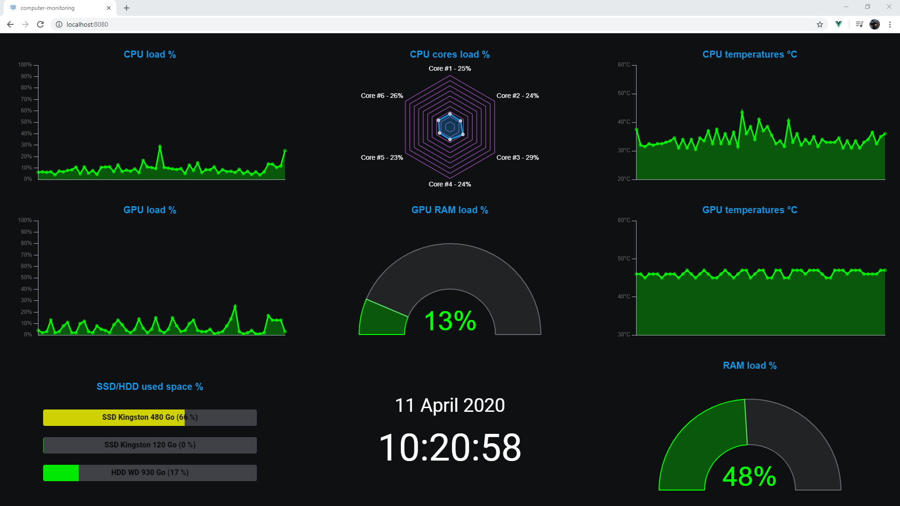
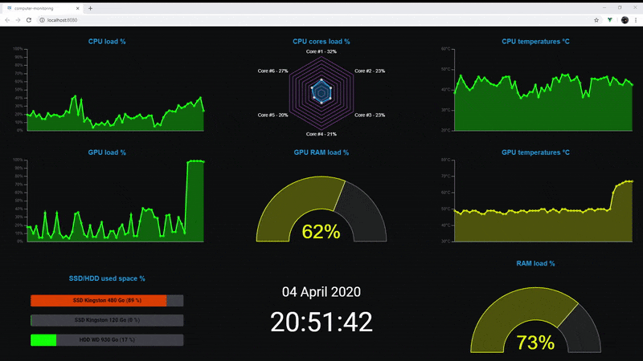

# Overview

Recently with the hot days of summer, my computer was suffering from the heat and sometimes it was shutting down unexpectedly. My high GPU usage mixed up with the ~35-45°C summer temperatures could make my computer shut down many times in a few hours.

As a solution I decided to use monitoring tools to watch the temperatures of my graphic card and processor to predict and then prevent any shutdown (by reducing the load for example). The tools I had found online could do the job and showed the temperatures in real time but I couldn't really make my own board or use multiple charts with a nice look as I wanted.

Since I'm a developer, I decided to create my own monitoring dashboard, the target was to code a simple but efficient monitoring tool suiting my needs.

I also wanted to try new languages/frameworks I've never used before to challenge myself and learn new things. I made a python back API collecting the data (temperatures, load...) from Open Hardware Monitor. And for the front, I chose to use VueJS and the library Chart.js to create the dashboard and charts. The server and the client communicate on a socket to ensure a permanent flow of data.

# Screen captures of the application
Screenshot


Video capture (converted to gif)


# How to install and run

## Installation
### Python api server
  - install <a href="https://openhardwaremonitor.org/">Open Hardware Monitor</a>
  - install <a href="https://www.python.org/">python</a> if you don't have it yet
  - install the required python libraries : socketio, wmi and eventlet
  <br>run the cmd as administrator and run theses commands to install the libraries :
    ```
    pip install python-socketio
    ```
    ```
    pip install WMI
    ```
    ```
    pip install eventlet
    ```
    time and json libraries are also required but they should be installed by default with python

### VueJS client
  - install <a href="https://nodejs.org/en/">Node.js</a> to get node and npm
  - open a CLI, navigate into the folder *Client/* of the project and install the packages with this command :
    ```
    npm install
    ```

## Run the application
### Python api server
- to start the python server you just need to launch the file *Server/server.py* with python

### VueJS client development mode
- start the client in development mode with the command :
    ```
    npm run serve
    ```
- the application is available on you browser at [http://localhost:8080/](http://localhost:8080/)

### VueJS client production mode
  - you can also build for production to deploy on a server with the command :
    ```
    npm run build
    ```
    it will create a folder *dist/* that you can use to deploy the application on your server
  
  - for example you can run the application client on a python server

    to serve the client with python, use this command inside the *dist/* folder :
    ```
    python -m http.server 8080
    ```
  
  - the application is available on you browser at [http://localhost:8080/](http://localhost:8080/)